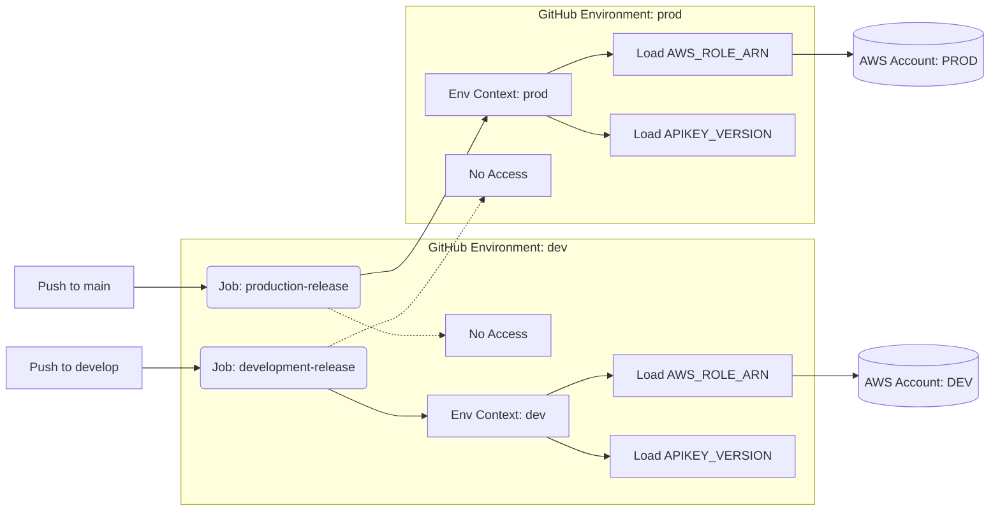

# Enterprise-Grade CI/CD Pipeline

This repository implements a **Production-Ready** CI/CD architecture designed for high-standard IT environments. It leverages GitHub Actions, Amazon ECR, and OIDC for secure, scalable, and high-performance container deployments.

## 🏗️ Architecture Overview

The pipeline uses a **Reusable Workflow** pattern to ensure consistency while maintaining strict isolation between development and production environments.

### Workflow Files:
- **[ecr-push.yml](.github/workflows/ecr-push.yml)**: The **Core Engine**. Handles Docker builds, ECR caching, security scanning, and multi-account logic.
- **[build_dev.yaml](.github/workflows/build_dev.yaml)**: Triggers on push to `develop` branch. Targets the `dev` environment.
- **[build_prod.yaml](.github/workflows/build_prod.yaml)**: Triggers on push to `main` branch. Targets the `prod` environment.

### Multi-Account Flow:


---

## 🔐 Security & Multi-Account Isolation

Standardizing on **GitHub Environments** allows us to deploy to completely different AWS accounts with zero risk of cross-contamination.

### 1. Identity over Keys (AWS OIDC)
We use **OpenID Connect (OIDC)** to authenticate with AWS. This eliminates the need for long-lived IAM Access Keys.
- Each environment (`dev`, `prod`) uses its own **IAM Role ARN**.
- Trust is established via a specific GitHub metadata (`sub` claim) linking the repository + environment to the AWS Role.

### 2. Hierarchical Image Tagging
The pipeline resolves image tags using a dual-lookup strategy:
1.  **Environment Specific**: Looks for `${SERVICE}_VERSION_${ENV}` (e.g., `APIKEY_VERSION_PROD`).
2.  **Generic (Scoped)**: Falls back to `${SERVICE}_VERSION` (e.g., `APIKEY_VERSION`). This is the recommended way when using GitHub Environments.

### 3. Automated Security Gates
- **ECR Image Scanning**: Triggered immediately after push.
- **Fail-on-Critical**: The pipeline **will exit with an error** if any **CRITICAL** vulnerabilities are found. This prevents unsafe images from being available for deployment.

---

## ⚡ Performance Optimizations

To minimize build times (from minutes down to seconds), the pipeline includes:
- **Docker Buildx**: Modern builder support.
- **GHA Caching**: Uses `type=gha` backend. Docker layers are stored in GitHub's internal cache and reused across runs.
- **Parallel Matrix**: Builds all services (`apikey`, `jwt`, `oidc-app`, `mock-idp`) in parallel processing.

---

## 🛠️ Setup Guide

### 1. Configure GitHub Environments
Go to **Settings > Environments** and create:
- `dev`
- `prod`

Inside each environment, set the following:
| Type | Name | Description |
|---|---|---|
| **Secret** | `AWS_ROLE_ARN` | The IAM Role ARN for that specific AWS Account. |
| **Variable** | `AWS_REGION` | The region (e.g., `ap-southeast-3`). |
| **Variable** | `SERVICE_VERSION` | Version tag for your containers. |

### 2. Configure AWS OIDC Trust
In each AWS Account, create an OIDC Identity Provider for GitHub and a Role with the following **Trust Policy**:

```json
{
    "Version": "2012-10-17",
    "Statement": [
        {
            "Effect": "Allow",
            "Principal": {
                "Federated": "arn:aws:iam::<ACCOUNT_ID>:oidc-provider/token.actions.githubusercontent.com"
            },
            "Action": "sts:AssumeRoleWithWebIdentity",
            "Condition": {
                "StringEquals": {
                    "token.actions.githubusercontent.com:aud": "sts.amazonaws.com"
                },
                "StringLike": {
                    "token.actions.githubusercontent.com:sub": "repo:ksatriow/lab-apikey-jwt-oidc:environment:<ENV_NAME>"
                }
            }
        }
    ]
}
```
*Replace `<ENV_NAME>` with `dev` or `prod` to restrict the Role to a specific environment.*

### 3. Notification Setup
The pipeline uses `ksatriow/action-mailer` to send build reports.
- **Required Secrets**: `SMTP_USERNAME`, `SMTP_PASSWORD`.
- **Configuration**: Edit `ecr-push.yml` to set your `from-email` and `to-email`.

---

## 📊 Monitoring Releases
Each release generates a rich log view:
- **Collapsed Technical Logs**: Detailed Docker build outputs are grouped to keep the UI clean.
- **Security Summary**: Scan results are printed directly in the job summary.
- **Email Report**: A summary containing the commit, actor, and security status is sent upon completion.
